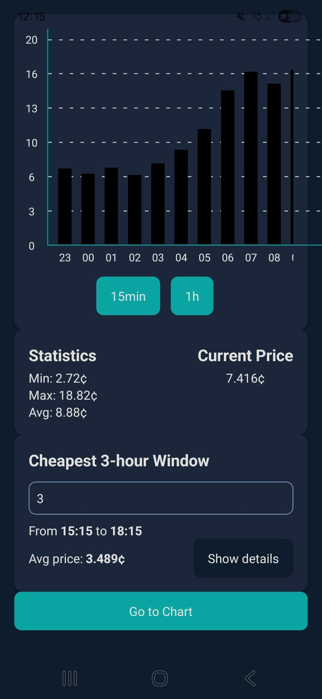
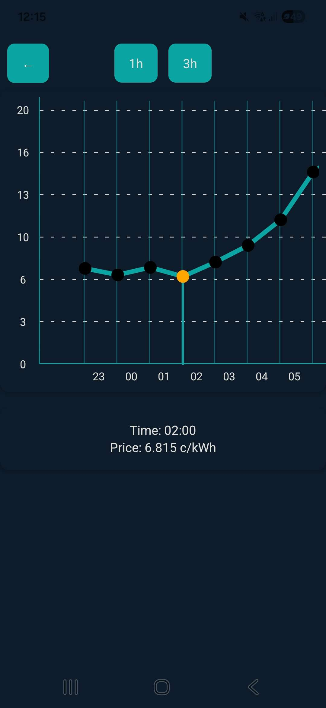

# Electricity Price App

React Native (Expo) frontend for a Finnish electricity spot price application.

The app visualizes Finnish electricity spot prices using interactive charts and shows the current price based on 15-minute market intervals. The UI is focused on exploring price trends at different time resolutions.

Backend can be found [here](https://github.com/Osku-dev/electricity-backend).

## Screenshots
Screenshots of WIP app UI:

